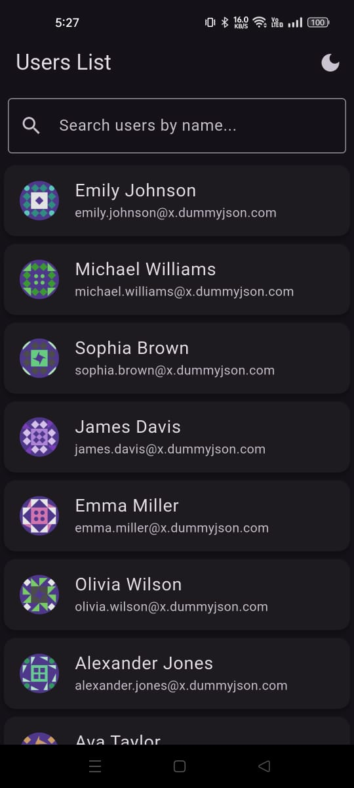
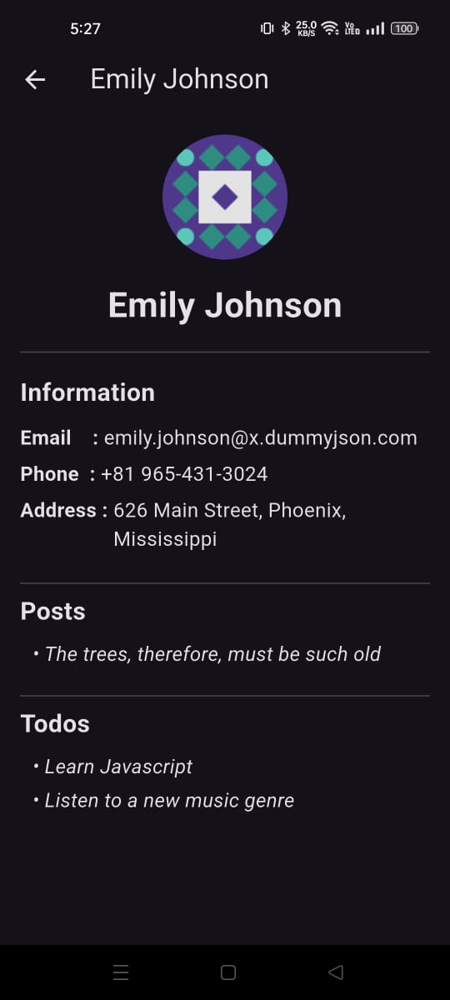
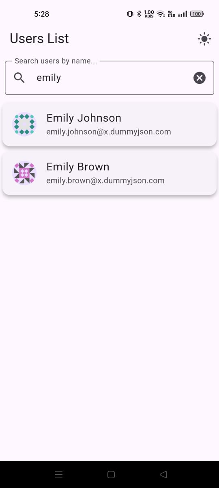

# 👤 User Info App(Flutter + BLoC)

A clean and modular Flutter screen developed as part of a **User Directory Module**, utilizing the BLoC pattern for state management. It fetches and displays user details along with associated posts and todos from the [DummyJSON API](https://dummyjson.com/).

---

## 📁 Project Overview

This Flutter application allows users to:

- View a list of users with infinite scroll and pagination
- Search users by name
- Pull-to-refresh the user list
- Navigate to a detailed view of each user
- View the user's posts and todos
- Switch between light and dark themes

---

## 📸 Screenshots


<p align="center">
  
  
  
</p>

---

## 🧱 Architecture Explanation

The app follows a **layered and modular architecture**:

### 1. Presentation Layer
- Contains all UI code (`screens`, `widgets`)
- Uses `BlocProvider` and `BlocBuilder` to connect UI with logic
- Focuses on rendering data based on current state

### 2. Business Logic Layer
- Located under `blocs/`
- `UserBloc`: Handles user list, search, pagination
- `UserDetailBloc`: Fetches user details, posts, and todos
- Emits loading, success, and error states

### 3. Data Layer
- `api_service.dart`: Abstracts all API calls
- Decouples networking from UI and logic

---

## 📂 Project Structure

```plaintext
lib/
├── main.dart                          # Entry point of the app
├── models/
│   └── user_model.dart                # Model class for User data
├── blocs/
│   ├── user/
│   │   ├── user_bloc.dart             # User list BLoC logic
│   │   ├── user_event.dart            # Events for user BLoC
│   │   └── user_state.dart            # States for user BLoC
│   └── user_details/
│       ├── user_details_bloc.dart     # User detail BLoC logic
│       ├── user_details_event.dart    # Events for detail BLoC
│       └── user_details_state.dart    # States for detail BLoC
├── services/
│   └── api_service.dart               # Handles API interactions
├── screens/
│   ├── user_list_screen.dart          # Main screen showing list of users
│   └── user_detail_screen.dart        # Screen showing user details
├── widgets/
│   └── ...                            # Reusable custom widgets
```
---

## 🚀 Setup Instructions

1. **Clone the Repository**
   ```bash
   git clone https://github.com/yourusername/task_manager_flutter.git
   cd task_manager_flutter

2. **Install Flutter Dependencies**
   ```bash
   flutter pub get

3. **Run the App**
   ```bash 
   flutter run

---
## 📂 Resources

- API: https://dummyjson.com/docs
- Flutter BLoC: https://bloclibrary.dev
